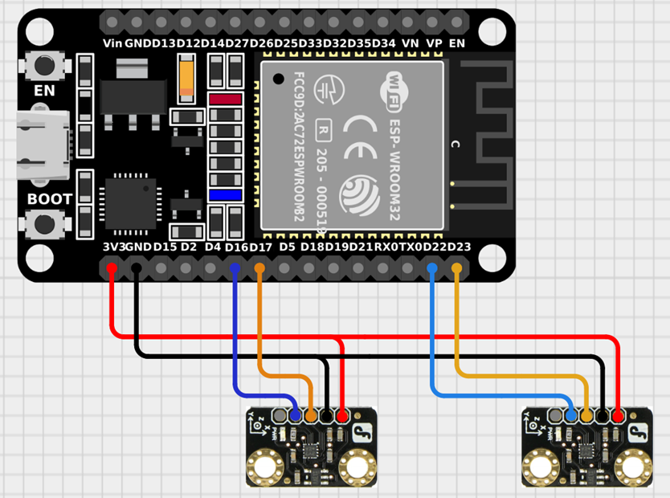

<h4 align="center">
  <pre>
   _____                                  _                                                  
  / ____|                                | |                                                 
 | |  __  __ _ _ __ __ _  __ _  ___    __| | ___   ___  _ __   ___  ___ _ __  ___  ___  _ __ 
 | | |_ |/ _` | '__/ _` |/ _` |/ _ \  / _` |/ _ \ / _ \| '__| / __|/ _ | '_ \/ __|/ _ \| '__|
 | |__| | (_| | | | (_| | (_| |  __/ | (_| | (_) | (_) | |    \__ |  __| | | \__ | (_) | |   
  \_____|\__,_|_|  \__,_|\__, |\___|  \__,_|\___/ \___/|_|    |___/\___|_| |_|___/\___/|_|   
                          __/ |                                                              
                         |___/                                                                
</pre>
</h4>

<h4 align="center">
The garage door opening sensor uses two accelerometers to monitor the change in the angle of inclination of individual door segments, which allows for determining its current status.
</h4>

	
	
	

## Connection schema

## Overview

The sensor uses two accelerometers mounted on a sectional garage door. The acceleration value on the Z-axis (gravitational acceleration) is read from both accelerometers. Based on the measured values, the door's status and the approximate percentage of the door's opening degree are determined. The method of approximating the opening degree value depends on the door's state.

The project was implemented using the ESP32-WROOM-32D microcontroller and two BMA220 accelerometers.

This project was created for IoT course on Technical University of Lodz.

## License

MIT

